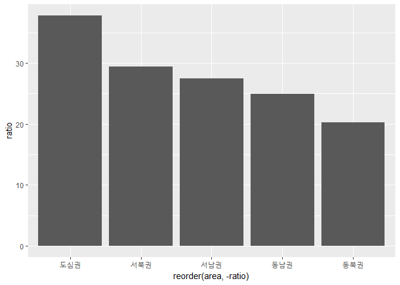
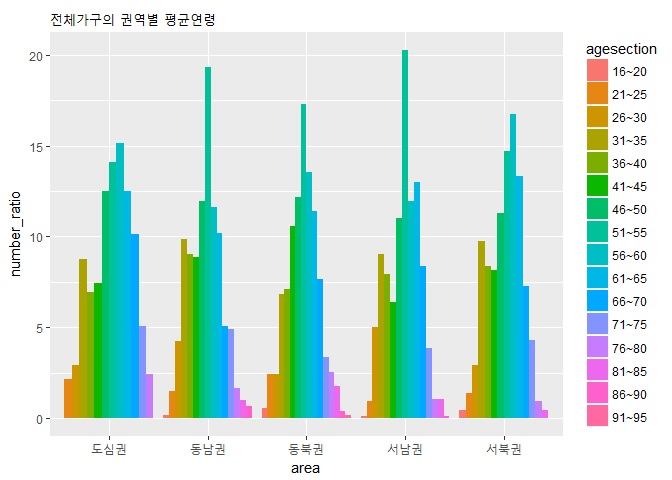
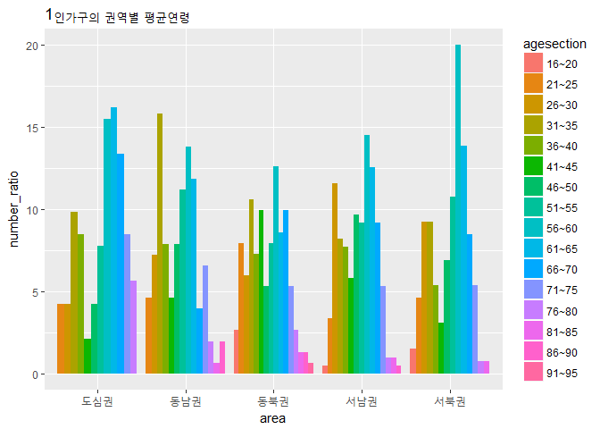
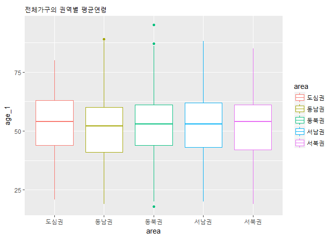
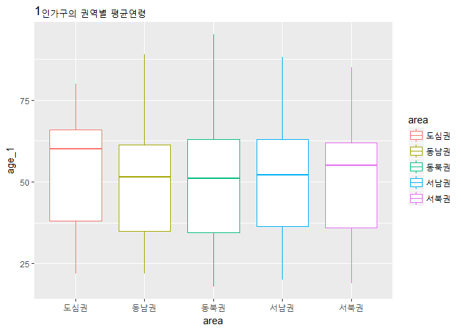
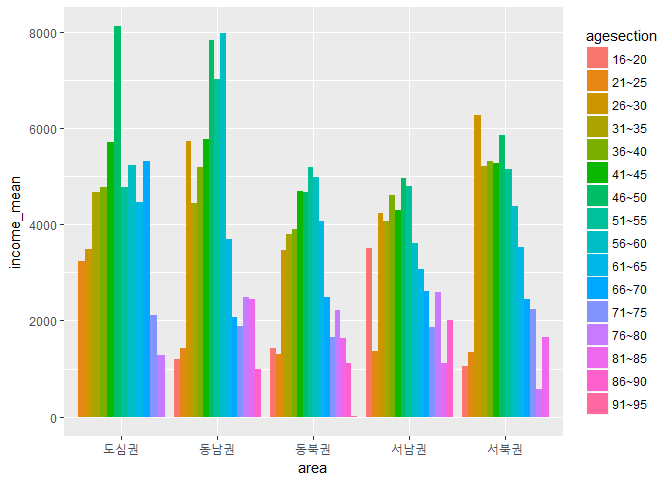
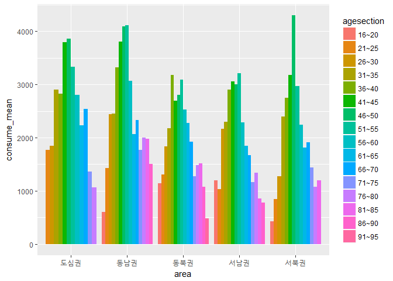

권역별 1인가구 비중과 1인가구 연령별 소득 지출분석
================

요약
----

서울의 권역별 1인가구의 비중과 1인가구의 연령별 소득지출 분석을 함으로써 실제 내가 살고 있는 서울의 권역별 1인가구 비중이 어떻게 되어있는지 알아보고, 1인가구가 점점 증가하는 추세 가운데 1인가구의 연령별 소득과 지출비중을 확인해보려고 한다. 서울연구데이터서비스의 자료를 사용했고 권역별 전체가구 중 1인가구 비중, 권역별 1인가구 연령분포, 권역, 연령별 1인가구 소득분포, 생활비 지출분포, 소득 대비 생활비 비중 분포 순으로 분석을 진행했다. 분석결과, 권역별 전체가구 중 1인가구 비중에서는 도심권의 전체가구 중 1인가구 비중이 눈에 띄게 높았고 서남권-서북권-동남권 순으로 약간의 차이가 있었고 동북권의 전체가구 중 1인가구 비중이 가장 적었다. 권역별 1인가구 연령분포에서는 도심권의 1인가구 중위연령이 타 권역보다 높았다. 또한 1인가구의 분포가 전체가구의 분포에 비해 중위권이 얇고 양극화된 양상을 보였다. 소득 대비 생활비 비중 분포에서는 대체로 61세 이상 연령대에서 생활비 비중의 분포가 높아지고 있긴 하나, 별 차이는 없는 것으로 나타났다.

분석 주제
---------

권역별 1인가구 비중과 1인가구 연령별 소득 지출분석

#### 문제의식

최근 혼인율 감소와 고령화 등이 맞물려 우리나라의 전체 가구 대비 1인가구의 비중이 커지고 있다. 통계청의 인구총조사에 따르면 전체 가구 중에서 1인 가구가 차지하는 비중은 2000년도 15.5%에서 2005년도에 20%로, 2010년에는 23.9%, 2015년 27.2%로 지속적인 증가 추이를 보이고 있다. 1인가구와 관련하여 주거 문제와 고독사 문제 등 사회문제가 늘어나는 가운데 서울시의 1인가구 비율은 무려 29.5%에 달하고있다.

#### 알아보고자 하는 것

서울시 권역별 1인가구 비중: 어느 권역의 1인가구 비중이 높은가? 서울시 권역별 1인가구 비중과 연령별 소득 중 생활비의 지출비중을 비교하여 1인가구의 분포와 경제적으로 취약한 연령대와 권역을 파악한다. 생활비 지출은 고정적인 반면 소득원은 불안정한 20대와 66세 이상 연령대에서 소득 중 생활비의 지출비중이 높을거라는 가설을 검증해본다.

데이터 선정
-----------

서울연구데이터서비스 <http://data.si.re.kr/sisurvey2015er17>

서울시의 3천가구를 5개 권역별로 나누어 가구일반사항, 경제활동, 건강과 의료 이용, 복지 서비스 이용 등을 조사한 자료이다.

분석
----

#### 데이터 전처리

``` r
#패키지 불러오기
library(readxl)
library(ggplot2)
library(dplyr)
```

``` r
#데이터 불러오기
rawdata <- read_excel('2015_서울복지실태조사_데이터.xlsx', sheet = 1, col_names = T)
```

``` r
#변수명 수정
rawdata <- rename(rawdata, income = B10_Total, consume = B2)
rawdata$area <- ifelse(rawdata$area == 1, '도심권',
                       ifelse(rawdata$area == 2, '동북권',
                       ifelse(rawdata$area == 3, '서북권',
                       ifelse(rawdata$area == 4, '서남권','동남권'))))
```

``` r
#결측치 확인
table(is.na(rawdata$area))
```

    ## 
    ## FALSE 
    ##  3019

``` r
table(is.na(rawdata$consume))
```

    ## 
    ## FALSE 
    ##  3019

``` r
table(is.na(rawdata$income))
```

    ## 
    ## FALSE 
    ##  3019

``` r
table(is.na(rawdata$fam_n))
```

    ## 
    ## FALSE 
    ##  3019

``` r
table(is.na(rawdata$age_1))
```

    ## 
    ## FALSE 
    ##  3019

결측치가 관찰되지 않았다.

``` r
#필요 변수만 추출 후 새 변수에 저장
rawdata2 <- rawdata %>% select(area, consume, income, fam_n, age_1)
head(rawdata2)
```

    ## # A tibble: 6 x 5
    ##   area   consume  income fam_n age_1
    ##   <chr>    <dbl>   <dbl> <dbl> <dbl>
    ## 1 서북권    200.      0.    4.   61.
    ## 2 동남권    250. 999999.    3.   65.
    ## 3 서북권    300. 999999.    3.   51.
    ## 4 서북권    300.   5450.    4.   53.
    ## 5 서북권    120.   5800.    2.   49.
    ## 6 서북권    100.     50.    2.   77.

``` r
str(rawdata2)
```

    ## Classes 'tbl_df', 'tbl' and 'data.frame':    3019 obs. of  5 variables:
    ##  $ area   : chr  "서북권" "동남권" "서북권" "서북권" ...
    ##  $ consume: num  200 250 300 300 120 100 450 420 200 250 ...
    ##  $ income : num  0 999999 999999 5450 5800 ...
    ##  $ fam_n  : num  4 3 3 4 2 2 3 2 4 4 ...
    ##  $ age_1  : num  61 65 51 53 49 77 58 49 50 50 ...

분석에 필요한 변수 5개만 추출하여 새 변수에 저장했다.

``` r
#이상치 발견 후 결측치 대체 및 제거
#consume, income변수의 모름/무응답 항목값인 9999와 999999을 결측치로 대체
rawdata2$consume <- ifelse(rawdata2$consume == 9999, NA, rawdata2$consume)
rawdata2$income <- ifelse(rawdata2$income == 999999, NA, rawdata2$income)

rawdata2 <- na.omit(rawdata2)
head(rawdata2)
```

    ## # A tibble: 6 x 5
    ##   area   consume income fam_n age_1
    ##   <chr>    <dbl>  <dbl> <dbl> <dbl>
    ## 1 서북권    200.     0.    4.   61.
    ## 2 서북권    300.  5450.    4.   53.
    ## 3 서북권    120.  5800.    2.   49.
    ## 4 서북권    100.    50.    2.   77.
    ## 5 서북권    450.   400.    3.   58.
    ## 6 서북권    420.   400.    2.   49.

``` r
str(rawdata2)
```

    ## Classes 'tbl_df', 'tbl' and 'data.frame':    2930 obs. of  5 variables:
    ##  $ area   : chr  "서북권" "서북권" "서북권" "서북권" ...
    ##  $ consume: num  200 300 120 100 450 420 200 250 100 100 ...
    ##  $ income : num  0 5450 5800 50 400 400 450 450 80 250 ...
    ##  $ fam_n  : num  4 4 2 2 3 2 4 4 2 1 ...
    ##  $ age_1  : num  61 53 49 77 58 49 50 50 70 68 ...
    ##  - attr(*, "na.action")=Class 'omit'  Named int [1:89] 2 3 75 217 237 250 322 359 441 461 ...
    ##   .. ..- attr(*, "names")= chr [1:89] "2" "3" "75" "217" ...

이상치(모름/무응답) 항목값을 결측처리 후 결측치 전체를 제거했다.

``` r
#생활비 지출 변수 consume는 월평균, 소득 변수 income은 연간 기준이므로 기준을 통일시키기 위해 B2변수값에 12를 곱해준다.
rawdata2$consume <-rawdata2$consume*12
```

### 권역별 1인가구 비중과 1인가구 연령별 소득 지출분석

#### 권역별 전체가구 중 1인가구 비중

``` r
rawdataonep <- rawdata2 %>%
  filter(fam_n == 1) %>% 
  group_by(area) %>% 
  summarise(n = n())
rawdataallp <- rawdata2 %>%
  group_by(area) %>% 
  summarise(n = n())
rawdataonep$ratio <- (rawdataonep$n / rawdataallp$n * 100)
rawdataonep
```

    ## # A tibble: 5 x 3
    ##   area       n ratio
    ##   <chr>  <int> <dbl>
    ## 1 도심권   142  37.8
    ## 2 동남권   152  24.9
    ## 3 동북권   151  20.2
    ## 4 서남권   207  27.4
    ## 5 서북권   130  29.4

``` r
ggplot(data = rawdataonep, aes(x = reorder(area, -ratio) , y = ratio)) + geom_col()
```



결과로 도심권의 전체가구 중 1인가구 비중이 눈에 띄게 높았고 서남권-서북권-동남권 순으로 약간의 차이가 있었고 동북권의 전체가구 중 1인가구 비중이 가장 적었다.

``` r
#권역별 1인가구 연령분포
#분석의 편의를 위해 나이를 구간별로 할당한다
age_section <-  data.frame(age_1 = c(11:100), agesection = c('11~15','11~15','11~15','11~15','11~15','16~20','16~20','16~20','16~20','16~20','21~25','21~25','21~25','21~25','21~25','26~30','26~30','26~30','26~30','26~30','31~35','31~35','31~35','31~35','31~35','36~40','36~40','36~40','36~40','36~40','41~45','41~45','41~45','41~45','41~45','46~50','46~50','46~50','46~50','46~50','51~55','51~55','51~55','51~55','51~55','56~60','56~60','56~60','56~60','56~60','61~65','61~65','61~65','61~65','61~65','66~70','66~70','66~70','66~70','66~70','71~75','71~75','71~75','71~75','71~75','76~80','76~80','76~80','76~80','76~80','81~85','81~85','81~85','81~85','81~85','86~90','86~90','86~90','86~90','86~90','91~95','91~95','91~95','91~95','91~95','96~100','96~100','96~100','96~100','96~100'))
rawdata2age <- rawdata2
rawdata2age <- left_join(rawdata2age, age_section, by = 'age_1')
table(rawdata2age$agesection)
```

    ## 
    ##  11~15  16~20  21~25  26~30  31~35  36~40  41~45  46~50  51~55  56~60 
    ##      0      8     48    106    255    231    245    344    518    393 
    ##  61~65  66~70  71~75  76~80  81~85  86~90  91~95 96~100 
    ##    351    221    122     50     29      8      1      0

연령분포의 분석의 편의를 위해 연령구간을 설정했다. 11-15세, 96-100세 구간은 존재하지 않아 0으로 처리되었다.

#### 권역별 1인가구 연령분포

``` r
rawdata2age2 <- rawdata2age %>%
  filter(fam_n == 1) %>% 
  group_by(area, agesection) %>% 
  summarise(number = n())
rawdata2age2tot <- rawdata2age %>%
  group_by(area, agesection) %>% 
  summarise(number = n())

rawdata2age2a <- rawdata2age2 %>%
  mutate(number_ratio = number / sum(number) * 100)
rawdata2age2tota <- rawdata2age2tot %>% 
  mutate(number_ratio = number / sum(number) * 100)

ggplot(data=rawdata2age2tota, aes(x = area, y = number_ratio , fill = agesection)) + 
  geom_col(position = 'dodge') +
  ggtitle('전체가구의 권역별 평균연령')
```



``` r
ggplot(data=rawdata2age2a, aes(x = area, y = number_ratio , fill = agesection)) + 
  geom_col(position = 'dodge') +
  ggtitle('1인가구의 권역별 평균연령')
```



권역별 1인가구를 전체가구(가구주 연령 기준)와 비교해 봤을 때 전체가구는 가운데가 뾰족한 형태인 반면에, 1인가구는 36-50세 구간의 비율이 현저하게 적어서 양극화가 심한 U자로 파인 형태이다. 1인가구의 권역간의 비교에는 동남권의 경우 31-35세 구간의 비율이 약 16%로 타 권역의 1.5배 이상이고, 서북권의 56-60세 구간의 비율이 20%로 역시 타 권역에 비해 많이 높았다. 그리고 65세이상 구간의 비율은 도심권에서 대체로 높게 나타났다. 아래에 집단 간 분포차이를 더 자세하게 알아보기 위해 박스플롯을 만들어 보았다.

``` r
ggplot(data=rawdata2age, aes(x = area, y = age_1 , col = area)) + 
  geom_boxplot() +
  ggtitle('전체가구의 권역별 평균연령')
```



``` r
rawdata2age1 <- rawdata2age %>% 
  filter(fam_n == 1)
ggplot(data=rawdata2age1, aes(x = area, y = age_1 , col = area)) + 
  geom_boxplot() +
  ggtitle('1인가구의 권역별 평균연령')
```



전체가구(가구주 연령 기준)의 경우 분포가 별로 넓지 않고 평균도 대체로 50세보다 조금 더 높은 수준이다. 그러나 1인가구의 경우 연령이 양극화되어있고 중위층이 얇기 때문에 분포가 넓다. 그리고 도심권의 중위연령이 타 권역보다 높다는 것을 알 수 있다.

#### 권역, 연령별 1인가구 소득분포

``` r
rawdata2agea <- rawdata2age %>% 
  group_by(area, agesection) %>% 
  summarise(income_mean = mean(income), consume_mean = mean(consume))
ggplot(data=rawdata2agea, aes(x = area, y = income_mean , fill = agesection)) + 
  geom_col(position = 'dodge')
```



대체로 사회생활에 진출하고 어느정도 시간이 경과한 31-50세 구간의 소득이 높음을 알 수 있다. 동북권, 서남권에 비해 도심권, 동남권의 소득이 대체로 높다는 사실도 알 수 있다. 또한 61세 이상 구간에서 소득이 대체로 급감함을 알 수 있다.

#### 권역, 연령별 1인가구 생활비 지출분포

``` r
ggplot(data=rawdata2agea, aes(x = area, y = consume_mean , fill = agesection)) + 
  geom_col(position = 'dodge')
```



#### 권역, 연령별 1인가구 소득 대비 생활비 비중 분포

``` r
rawdata2age4a <- rawdata2age %>% 
  group_by(area, agesection) %>% 
  summarise(consumeratio_mean = mean(consume)/mean(income))
ggplot(data=rawdata2age4a, aes(x = area, y = consumeratio_mean , fill = agesection)) + 
  geom_col(position = 'dodge')
```


앞에서 생활비 지출은 고정적인 반면 소득원은 불안정한 20대와 66세 이상 연령대에서 소득 중 생활비의 지출비중이 높을거라는 가설을 세웠다. 대체로 61세 이상 연령대에서 생활비 비중의 분포가 높아지고 있긴 하나, 유의미한 수준으로 보이진 않으므로 가설을 기각한다. 동북권 91-95세 구간에 극단치가 존재하고 있다.

결론
----

도심권의 1인가구 비중이 매우 높다는 사실을 알았고, 1인가구의 연령별 비중이 양극화 되어있다는 사실을 알게 되었다. 그러나 소득원은 불안정한 20대와 66세 이상 연령대에서 소득 중 생활비의 지출비중이 높을거라는 가설과는 달리 연령별로 소득 중 생활비 지출비중에서 유의미한 차이가 있지 않았다.

#### 한계점 및 비판점

1.  변수를 설정할 때 생활비 지출액은 단순히 월 평균 생활비 지출액에 12를 곱해서 연간단위인 소득에 맞추었기 때문에 실제와 다를 가능성이 크다.
2.  3천명의 표본 가운데 1인가구수를 대상으로 다시 한 번 필터링했기 때문에 표본의 부족으로 평균과는 거리가 있는 극단치가 발생했다.
3.  원자료가 서울의 모든 25개 자치구가 아닌 5개 권역만을 대상으로 조사를 진행한 결과이기 때문에 비교의 의미가 희석된다.
4.  분석하려는 변수 개수를 지나치게 많이 설정하여 분석이 산만해졌고 의미있는 결과를 도출해내지 못했다.

#### 추후 분석 방향

소득에 대응하여 생활비 대신 소비를 더 대표할 수 있는 변수가 있는 데이터가 추가된 자료를 다루면 더 유의미한 분석이 가능하지 않을까 생각한다. 1인가구와 전체가구의 소득 중 생활비 지출비중의 분포 또한 더 분석해볼 수 있을 것 같다. 매년 1인가구 비중이 높아지는 추이라서 연도별 데이터가 존재한다면 추이 분석을 하겠다.

#### 수업과 책에서 다루지 않은 패키지, 함수, 그래프 활용

``` r
#패키지 불러오기
library(plotly)
##데이터 가공
raw <- read_excel('2015_서울복지실태조사_데이터.xlsx', sheet = 1, col_names = T)
x <- raw %>% 
  filter(fam_n == 1) %>% 
  select(area,age_1)
x2 <- raw %>%  
  select(area,age_1)
dosim <- x %>% filter(area == 1)
dongbuk <- x %>% filter(area == 2)
seobuk <- x %>% filter(area == 3)
seonam <- x %>% filter(area == 4)
dongnam <- x %>% filter(area == 5)
dosimdf<- as.data.frame.matrix(table(dosim)) 
dosimdf <- as.data.frame(t(dosimdf))
dongbukdf <- as.data.frame.matrix(table(dongbuk))
dongbukdf <- as.data.frame(t(dongbukdf))
seobukdf <- as.data.frame.matrix(table(seobuk))
seobukdf <- as.data.frame(t(seobukdf))
seonamdf <- as.data.frame.matrix(table(seonam))
seonamdf <- as.data.frame(t(seonamdf))
dongnamdf <- as.data.frame.matrix(table(dongnam))
dongnamdf <- as.data.frame(t(dongnamdf))
dosimdf <- cbind(rownames(dosimdf), dosimdf)
rownames(dosimdf) <- NULL
colnames(dosimdf) <- c("age","1")
dongbukdf <- cbind(rownames(dongbukdf), dongbukdf)
rownames(dongbukdf) <- NULL
colnames(dongbukdf) <- c("age","2")
seobukdf <- cbind(rownames(seobukdf), seobukdf)
rownames(seobukdf) <- NULL
colnames(seobukdf) <- c("age","3")
seonamdf <- cbind(rownames(seonamdf), seonamdf)
rownames(seonamdf) <- NULL
colnames(seonamdf) <- c("age","4")
dongnamdf <- cbind(rownames(dongnamdf), dongnamdf)
rownames(dongnamdf) <- NULL
colnames(dongnamdf) <- c("age","5")


dosim2 <- x2 %>% filter(area == 1)
dongbuk2 <- x2 %>% filter(area == 2)
seobuk2 <- x2 %>% filter(area == 3)
seonam2 <- x2 %>% filter(area == 4)
dongnam2 <- x2 %>% filter(area == 5)
dosim2df<- as.data.frame.matrix(table(dosim2)) 
dosim2df <- as.data.frame(t(dosim2df))
dongbuk2df <- as.data.frame.matrix(table(dongbuk2))
dongbuk2df <- as.data.frame(t(dongbuk2df))
seobuk2df <- as.data.frame.matrix(table(seobuk2))
seobuk2df <- as.data.frame(t(seobuk2df))
seonam2df <- as.data.frame.matrix(table(seonam2))
seonam2df <- as.data.frame(t(seonam2df))
dongnam2df <- as.data.frame.matrix(table(dongnam2))
dongnam2df <- as.data.frame(t(dongnam2df))
dosim2df <- cbind(rownames(dosim2df), dosim2df)
rownames(dosim2df) <- NULL
colnames(dosim2df) <- c("age","1")
dongbuk2df <- cbind(rownames(dongbuk2df), dongbuk2df)
rownames(dongbuk2df) <- NULL
colnames(dongbuk2df) <- c("age","2")
seobuk2df <- cbind(rownames(seobuk2df), seobuk2df)
rownames(seobuk2df) <- NULL
colnames(seobuk2df) <- c("age","3")
seonam2df <- cbind(rownames(seonam2df), seonam2df)
rownames(seonam2df) <- NULL
colnames(seonam2df) <- c("age","4")
dongnam2df <- cbind(rownames(dongnam2df), dongnam2df)
rownames(dongnam2df) <- NULL
colnames(dongnam2df) <- c("age","5")

#데이터 병합
dfage <- data.frame(age = factor(c(1:100)),a = NA)
df <- left_join(dfage, dosimdf, by='age')

combined <- sort(union(levels(dfage$age), levels(dosimdf$age)))
n <- left_join(mutate(dfage, age=factor(age, levels=combined)),
               mutate(dosimdf, age=factor(age, levels=combined)))
n2 <- left_join(mutate(n, age=factor(age, levels=combined)),
                mutate(dongbukdf, age=factor(age, levels=combined)))
n3 <- left_join(mutate(n2, age=factor(age, levels=combined)),
                mutate(seobukdf, age=factor(age, levels=combined)))
n4 <- left_join(mutate(n3, age=factor(age, levels=combined)),
                mutate(seonamdf, age=factor(age, levels=combined)))
n5 <- left_join(mutate(n4, age=factor(age, levels=combined)),
                mutate(dongnamdf, age=factor(age, levels=combined)))
n5 <- n5 %>% 
  select(-a, -age)
head(n5)
```

    ##    1  2  3  4  5
    ## 1 NA NA NA NA NA
    ## 2 NA NA NA NA NA
    ## 3 NA NA NA NA NA
    ## 4 NA NA NA NA NA
    ## 5 NA NA NA NA NA
    ## 6 NA NA NA NA NA

``` r
dfage <- data.frame(age = factor(c(1:100)),a = NA)
df2 <- left_join(dfage, dosim2df, by='age')

combined <- sort(union(levels(dfage$age), levels(dosim2df$age)))
nt <- left_join(mutate(dfage, age=factor(age, levels=combined)),
               mutate(dosim2df, age=factor(age, levels=combined)))
nt2 <- left_join(mutate(nt, age=factor(age, levels=combined)),
                mutate(dongbuk2df, age=factor(age, levels=combined)))
nt3 <- left_join(mutate(nt2, age=factor(age, levels=combined)),
                mutate(seobuk2df, age=factor(age, levels=combined)))
nt4 <- left_join(mutate(nt3, age=factor(age, levels=combined)),
                mutate(seonam2df, age=factor(age, levels=combined)))
nt5 <- left_join(mutate(nt4, age=factor(age, levels=combined)),
                mutate(dongnam2df, age=factor(age, levels=combined)))
nt5 <- nt5 %>% 
  select(-a, -age)
head(nt5)
```

    ##    1  2  3  4  5
    ## 1 NA NA NA NA NA
    ## 2 NA NA NA NA NA
    ## 3 NA NA NA NA NA
    ## 4 NA NA NA NA NA
    ## 5 NA NA NA NA NA
    ## 6 NA NA NA NA NA

``` r
#결측치 처리
n5$'1' <- ifelse(is.na(n5$'1'),0,n5$'1')
n5$'2' <- ifelse(is.na(n5$'2'),0,n5$'2')
n5$'3' <- ifelse(is.na(n5$'3'),0,n5$'3')
n5$'4' <- ifelse(is.na(n5$'4'),0,n5$'4')
n5$'5' <- ifelse(is.na(n5$'5'),0,n5$'5')
nt5$'1' <- ifelse(is.na(nt5$'1'),0,nt5$'1')
nt5$'2' <- ifelse(is.na(nt5$'2'),0,nt5$'2')
nt5$'3' <- ifelse(is.na(nt5$'3'),0,nt5$'3')
nt5$'4' <- ifelse(is.na(nt5$'4'),0,nt5$'4')
nt5$'5' <- ifelse(is.na(nt5$'5'),0,nt5$'5')
head(n5)
```

    ##   1 2 3 4 5
    ## 1 0 0 0 0 0
    ## 2 0 0 0 0 0
    ## 3 0 0 0 0 0
    ## 4 0 0 0 0 0
    ## 5 0 0 0 0 0
    ## 6 0 0 0 0 0

``` r
#데이터프레임의 숫자행렬화
n5nm <- as.matrix(sapply(n5, as.numeric))
nt5nm <- as.matrix(sapply(nt5, as.numeric))
```

#### 3D 그래프 (HTML 전용이라 비활성화) X축: 권역(1:도심권, 2:동북권, 3:서북권, 4:서남권, 5:동남권) Y축: 연령(1-100), Z축: 가구수

#### 3D 그래프2 (HTML 전용이라 비활성화) X축: 권역(1:도심권, 2:동북권, 3:서북권, 4:서남권, 5:동남권) Y축: 연령(1-100), Z축: 가구수
